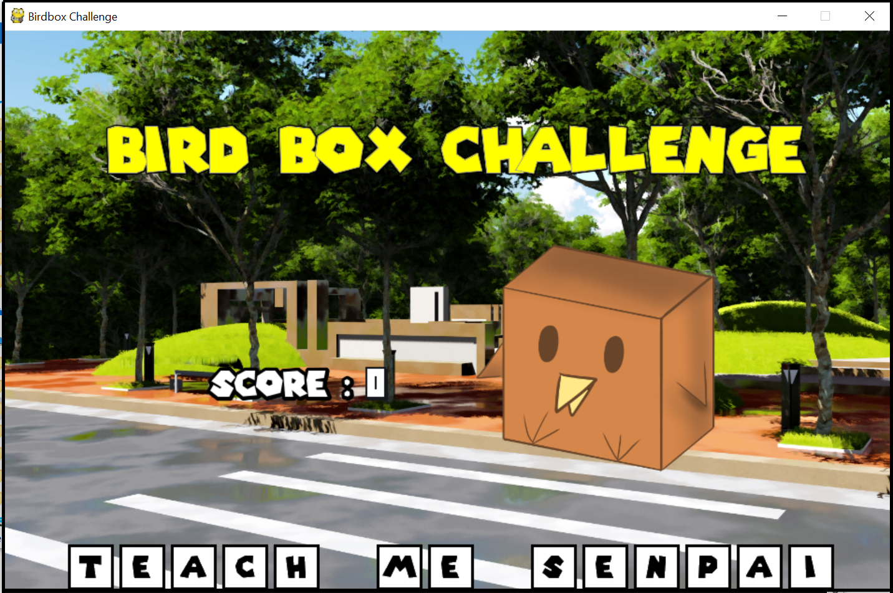

# Bird Box Challenge  

  
Help Truck-kun avoid Bird Boxes on the road!  
And just like in the movie Bird Box, sometimes you can't see them coming... literally!  

## Project Overview
Bird Box Challenge is a game that introduces gamification to typical physiotherapy, making it fun for patients.  
This is made possible by attaching a tracking hardware (for orientation and accelerations) to affected limbs.
However for this project, a mobile phone using the Sensor UDP app was used in place of an accelerometer.  

Different difficulties and extensions of the game can be further added to cater to the needs of physiotherapy patients with varying conditions and severities.  
This small project aims to become a Proof of Concept for future gamification ideas such as this! (:  


## Getting Started

These instructions will get you a copy of the project up and running on your local machine for development and testing purposes. See deployment for notes on how to deploy the project on a live system.

### Prerequisites

* [Python 3.5.3 or above](https://www.python.org/)
* [pip 18.1 or above](https://pypi.org/project/pip/)

If your OS does not have pip installed, use the following command:

```
sudo easy-install pip
```


### Installing

1. Clone the directory
2. Enter the directory by typing in this command

```
cd Bird-Box-Challenge
```

3. Install prerequisite libraries with the following command:

```
pip install -r requirements.txt
```

## Usage

To run the game, enter the command
```
python3 main.py
```


## Built With

* Languages
    * [Python 3.5.3](https://www.python.org/) - For its standard libraries.

* Frameworks and Libraries
    * [Pygame](https://www.pygame.org/news) - For running games.


## Contributing

No public contributions expected as of now.

## Authors

* **Tan Yong He** - [tanyonghe](https://github.com/tanyonghe)
* **Lou Shaw Yeong** - [xiaoyeong](https://github.com/xiaoyeong)

## License

This project is licensed under the GNU GPL v3 - see the [LICENSE.md](LICENSE.md) file for details.

## Acknowledgments

* [Ride-the-Road](https://github.com/SundeepChand/Ride-the-Road) for the basic game idea.
